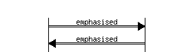
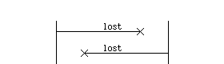
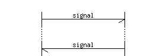
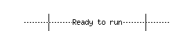
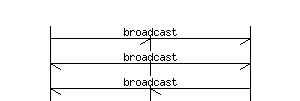
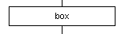
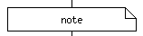

# How to encode Message Sequence Charts within doxygen comments?

Message Sequence Chart doxygen addon [see](http://www.mcternan.me.uk/mscgen/) allows that

* Install the addon (according to the above documentation link)
* Encode comments according to thereafter syntax reference

# Syntax reference

<table border="1">
 <tbody><tr>
    <th>Graphic</th>
    <th>Source Representation</th>
    <th>Meaning</th>
  </tr>
  <tr>
    <td>

</td>
    <td>
-&gt; or &lt;-
</td>
    <td>
Message
</td>
  </tr>
  <tr>
    <td>

</td>
    <td>
=&gt; or &lt;=
</td>
    <td>
Method or function call
</td>
  </tr>
  <tr>
    <td>

</td>
    <td>
&gt;&gt; or &lt;&lt;
</td>
    <td>
Method or function return value
</td>
  </tr>
  <tr>
    <td>

</td>
    <td>
=&gt;&gt; or &lt;&lt;=
</td>
    <td>
Callback
</td>
  </tr>
  <tr>
    <td>

</td>
    <td>
:&gt; or &lt;:
</td>
    <td>
Emphasised Message
</td>
  </tr>
  <tr>
    <td>

</td>
    <td>
-x or x-
</td>
    <td>
Lost Message
</td>
  </tr>
  <tr>
    <td>

</td>
    <td>
...
</td>
    <td>
Indicates that some signals may be deliberately omitted
                from the msc, or that some large period of time may have passed.
</td>
  </tr>
  <tr>
    <td>

</td>
    <td>
---
</td>
    <td>
Used to add comment to a block of signals or indicate some
                action or state has occurred.
</td>
  </tr>
  <tr>
    <td>

</td>
    <td>
|||
</td>
    <td>
Used to add extra space between rows.
</td>
  </tr>
  <tr>
    <td>

</td>
    <td>
-&gt;* or *&lt;-
</td>
    <td>
Broadcast arcs, where the arc is extended to all but the source
                entity.  Any arc label is centred across the whole chart.
</td>
  </tr>
  <tr>
    <td>

</td>
    <td>
box
</td>
    <td>
Box arcs, where the arc is replaced with a box between the selected
                entities.  Any arc label is centred in the box and word
                wrapped if needed.
</td>
  </tr>
  <tr>
    <td>

</td>
    <td>
rbox
</td>
    <td>
Rounded box arcs, where the arc is replaced with a box between the
                selected entities.  Any arc label is centred in the box and word
                wrapped if needed.
</td>
  </tr>
  <tr>
    <td>

</td>
    <td>
abox
</td>
    <td>
Angular box arcs, where the arc is replaced with a box between the
                selected entities.  Any arc label is centred in the box and word
                wrapped if needed.
</td>
  </tr>
  <tr>
    <td>

</td>
    <td>
note
</td>
    <td>
Note box arcs, where the arc is replaced with a box between the
                selected entities.  Any arc label is centred in the box and word
                wrapped if needed.
</td>
  </tr>
</tbody></table>

# How to use it within C code?

<pre>
<code>
/** Request a fandango on core.
 * Sending this signal to the Iberian dance task will cause it to create a
 * wild pointer which is then used to corrupt the malloc arena leading to
 * mysterious failures later on in the program execution.
 *
 *\msc
 *  T,"Iberian Dance Task";
 *
 *  T->"Iberian Dance Task" [label="IbFandangoReq", URL="\ref IbFandangoReq"];
 *  T<<"Iberian Dance Task" [label="IbFandangoCnf", URL="\ref IbFandangoCnf", ID="1"];
 *\endmsc
 *
 * <OL>
 * <LI>In some cases, the system may have failed before this signal is sent
 *     or received, in which case the confirm maybe lost.
 * </OL>
 */
typedef struct IbFandangoReqTag
{
  TaskId reqTaskId;
}
IbFandangoReq;
</code>
</pre>
